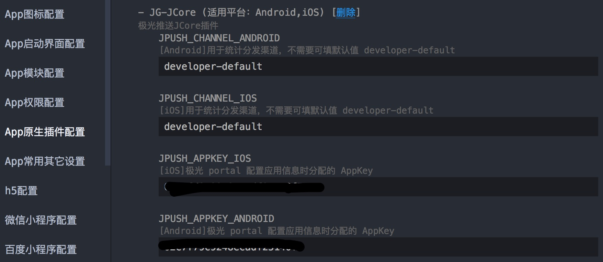

# jcore-hbuilder-plugin

极光SDK基础组件。极光SDK使用都需要依赖该组件。

## 接入
- 1.将 nativeplugins/JG-JCore 导入项目对应位置。
- 2.项目 manifest.json 中接入 JG-JCore 插件。并配置好 appkey([极光 portal]() 注册分配)，channel 信息。

    <a target="_blank">
        
    </a>

## Support
- 更多问题请前往[极光社区](http://community.jiguang.cn/)

## License

MIT © [JiGuang](/license)

